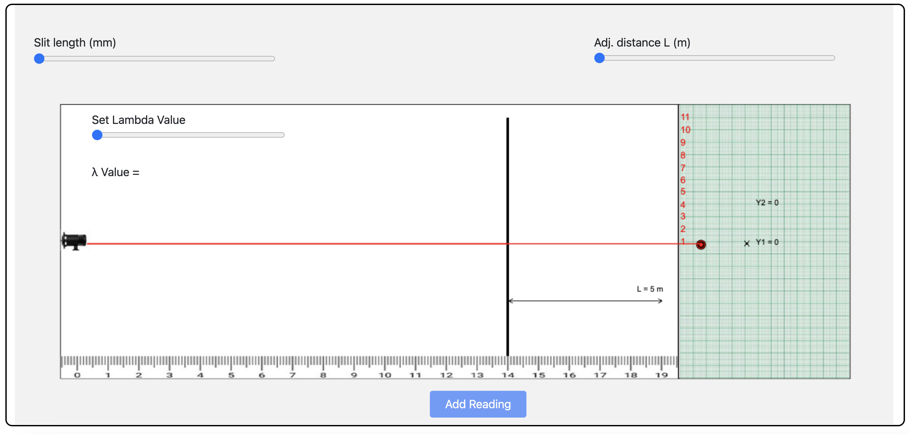
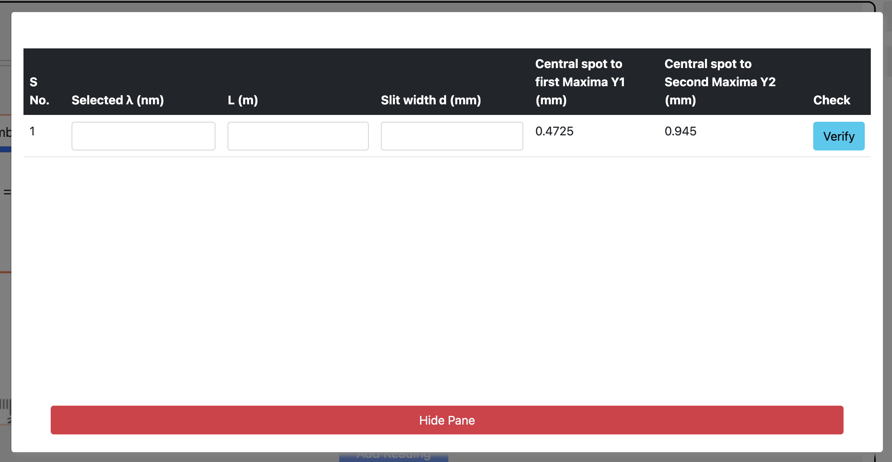

<h2>Procedure: </h2>

<ul>
<li>Move the sliders and observe the changes with respect to d, distance between slit and screen and wavelength.</li>

<li>Add five entries in oberservation table</li>
</ul>

 
